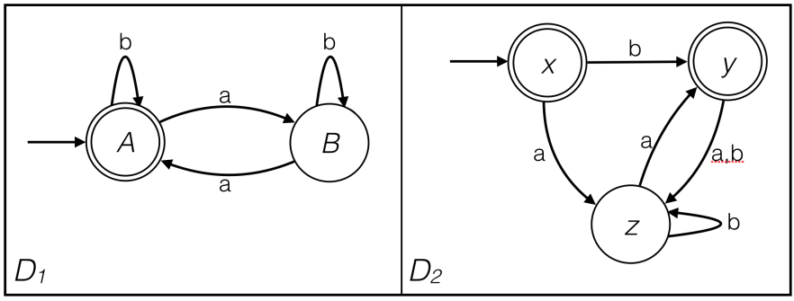
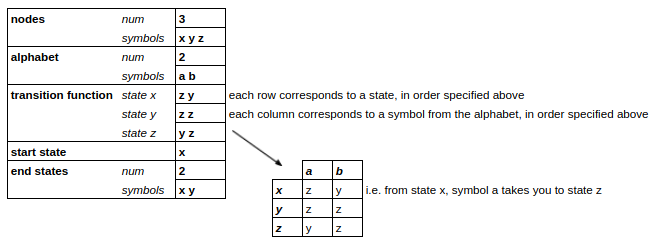

DFA_Equivalence
===============

Command line tool to determine the Equivalence of DFAs
------------------------------------------------------

Deterministic Finite Automata (DFAs) are finite state machines that accept or
reject strings of symbols in a pre-determined way- there is only 1 possible result
for each input string.

This program will take any input DFA (encoded as below) and return whether
they are equivalent, i.e. they recognise the same language.

Two sample DFA input files are given (in inputDFAs dir), equivalent to the below DFAs:

DFA Encoding
-------------

These are encoded as text files. Below is the encoding for D2:

    3 
    x y z 
    2 
    a b 
    z y 
    z z 
    y z 
    x 
    2 
    x y 

The structure of this encoding is as follows:

_________________________________________________________________________

To run the program
-------------------

**Run 'dfa.py' with Python3 from the command line with the following arguments:**

**1. Complement [D]**
    
       python3 dfa.py complement inputDFAs/D1.txt

**2. Intersection [D1] [D2]**

       python3 dfa.py intersection inputDFAs/D1.txt inputDFAs/D2.txt

**3. Symmetric difference [D1] [D2]**

       python3 dfa.py difference inputDFAs/D1.txt inputDFAs/D2.txt

**4. Non-emptyness [DFA]**

       python3 dfa.py empty inputDFAs/D1.txt

**5. Equivalence [D1] [D2]**

       python3 dfa.py equivalent inputDFAs/D1.txt inputDFAs/D2.txt

